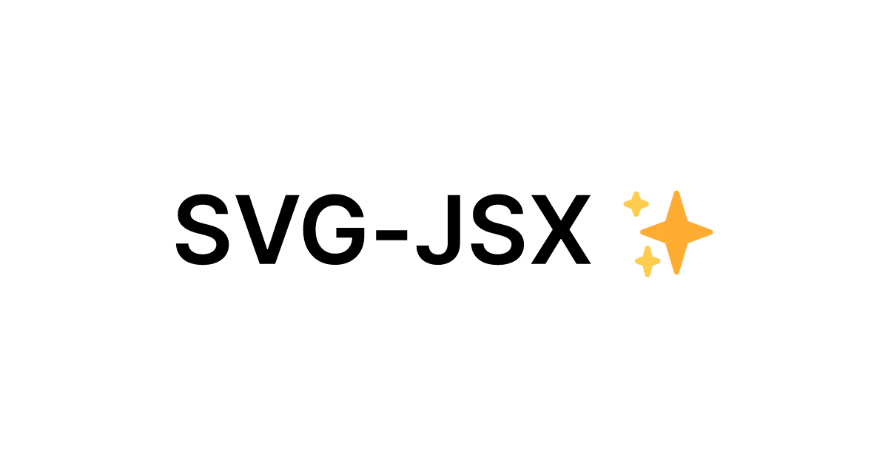

# SVG-JSX

Build your own JSX components icon library!
Free and Open Source.

## Live Site

Visit [website](https://svg-jsx.vercel.app) to try it out!

## Tech Stack

- [Next.js](https://nextjs.org/docs/getting-started/installation) - Built using the new App Router
- [shadcn/ui](https://ui.shadcn.com/docs/components/toast) - High-quality, ready-made, React UI components
- [SVGR](https://react-svgr.com/) - Transform SVG into JSX
- [Babel](https://babeljs.io/docs/babel-core) - Convert JSX into AST
- [JSZip](https://github.com/Stuk/jszip) - Create zip files
